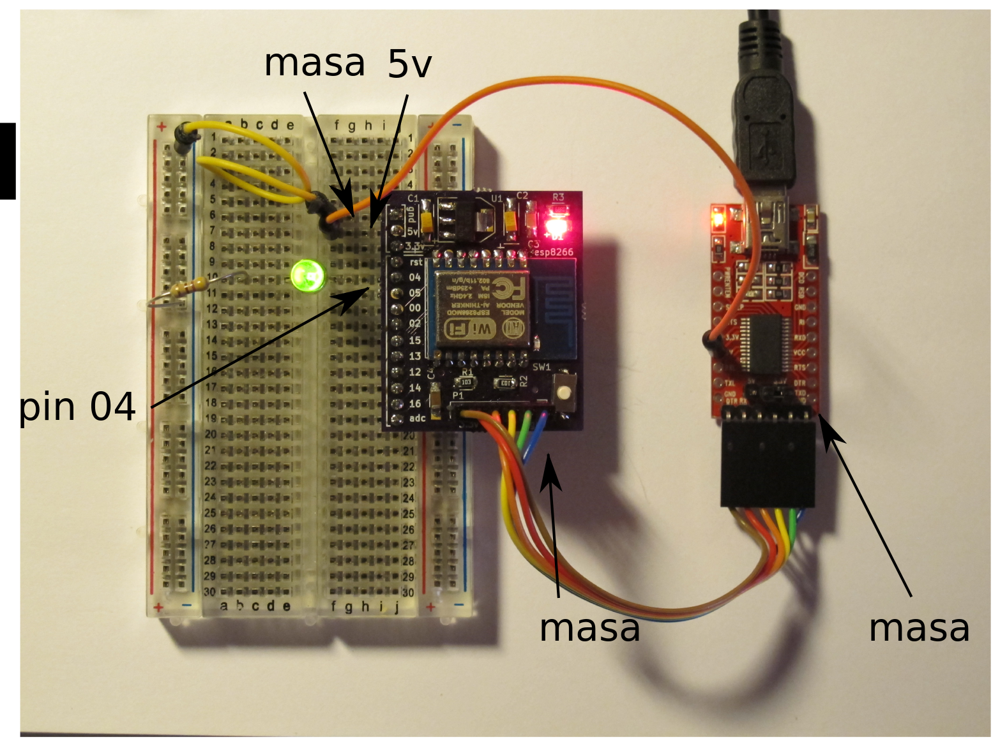

# Documentacion del taller

link para esta documentacion es http://ven.nz/esp-workshop

# Instalar el ESP8266 core

Necesitamos el ESP8266 core para construir neustros firmwares. [Documentacion
para functionalidad](https://github.com/esp8266/Arduino/blob/esp8266/hardware/esp8266com/esp8266/doc/reference.md)

## Instrucciones

[Sequir las instrucciones aqui](https://github.com/esp8266/Arduino#installing-with-boards-manager)

# experimentacion AT

Los primeras placas ESP fueron usadas solo para interace WIFI con un
microcontolador.

Para configurar el ESP, se usan commandos AT de forma similar para a los modulos
GPS o GSM.

## Instrucciones

Montar el circuito de abajo:

* LED +ve a pin 04
* LED -ve via resistencia a masa
* La linea 5v de USB se connecta con el regulador porque la regulador del chip
 FTDI no es feurte

En el IDE Arduino, activa el monitor serial y proba los commandos de abajo:

### Lista de redes disponibles

    AT+CWMODE=3
    AT+CWLAP

### Unirse y mostrar detalles

    AT+CWJAP="SSID","PASSWORD"
    AT+CIFSR

### Conectado a mattvenn.net puerto 40000

    AT+CIPSTART=4,"TCP","77.73.6.229",40000

# Parpadear

El programa el 'hola mundo'. Programaremos un ejemplo para parapadear un LED connectado con el ESP8266.

## Instructions

Cargar el ejemplo blink y cambia todos las referencias al pin 13 a pin 5.

El LED se conecta al pin 4 porque modulo ESP-12 cambio los pins 4 y 5 despues de
que la PCBs fuera diseñada.

En el IDE Arduino, cambia:

* tools->board = generic ESP8266
* tools->upload speed = 921600

Pulsar el boton 'Upload' y a la vez pulsar el boton en la placa.

## Tareas advanzados

* Parapadear una sequencia mas complicado
* Añade un buton
* Utiliza el ADC (voltaje maximo 1v)

# Parapadear de WIFI

Ahora instalamos dos librarios que tienen functionalidad
[REST](http://arest.io/). Despues puedamos util un browser para parapadear el
LED.

## Instrucciones

[Instalar los dos librarios](https://www.arduino.cc/en/Guide/Libraries#toc4):

* [aREST_UI](https://github.com/marcoschwartz/aREST_UI/archive/master.zip)
* [aREST](https://github.com/marcoschwartz/aREST/archive/master.zip)

Cargar el ejemplo aREST UI->ESP8266

Cambia los paramateros WIFI (SSID & Secreto)

Pulsar el boton 'Upload' y a la vez pulsar el boton en la placa.

Activa el monitor serial y buscar para el address IP

En tu browser, vas el IP

Control el LED para pulsar los botones

## Tareas advanzados

* Añadir un otre LED
* Util el control deslizadoro para brillo LED

# Dregistro de datos con Sparkfun

Ahora enviamos datos para WIFI. Empazamos solo enviar el ESP8266 tiempo desde
reset. Sparkfun tiene un servicio libro se llama Phant.

## Instrucciones

Vas a [data.sparkfun.com](https://data.sparkfun.com/streams/make)

Llenar los espacios en blanco (para el espacio 'fields', util 'value')

Pulsar 'save' y guardar los llaves entre el archivo JSON

En Arduino IDE, cargar el ejemplo ESP8266Wifi->WifiClient

Cambia los paramateros WIFI (SSID & Secreto)

Cambiar streamId & privateKey a tus llaves (en el archivo JSON)

Pulsar el boton 'Upload' y a la vez pulsar el boton en la placa.

Activa el monitor serial y mirar datas enviar.

## Tareas advanzados

* util un boton o un sensor temperatura
* [Hacer un gráfico](http://phant.io/graphing/google/2014/07/07/graphing-data/)
 con gráficos de google.

# Reposo

En reposo, es possible consumo menos de 18uA. Necessitas conectar GPIO16 a reset
La placa utilamos hoy consumo mas porque el regulador.

## Instrucciones

Hacer modo reposo:

    [ESP.deepSleep(microseconds, mode)](https://github.com/esp8266/Arduino/blob/esp8266/hardware/esp8266com/esp8266/doc/reference.md#esp-specific-apis)

Duespes despierta, el programa empezar en el partir de abrir.
