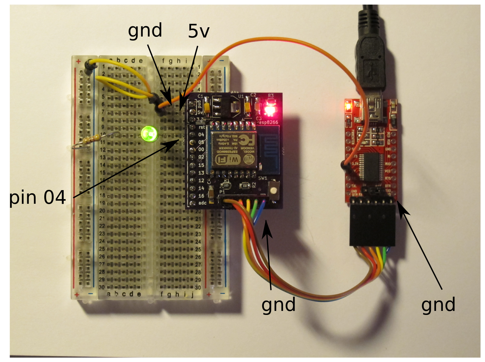

# Workshop handout

shortlink for this page is http://ven.nz/esp-workshop

# Install the ESP8266 core

We need the ESP8266 core to let us build our own firmwares. [Documentation for additional functionality is here](https://github.com/esp8266/Arduino/blob/esp8266/hardware/esp8266com/esp8266/doc/reference.md)

## Instructions

[Follow the instructions here](https://github.com/esp8266/Arduino#installing-with-boards-manager)

# AT experimentation

The first ESP boards were used just as a WIFI interface for a microcontroller.
Similar to GPS or GSM modules, AT commands are used for configuring the ESP.

When you buy a new ESP chip, it will come loaded with the default AT firmware.

## Instructions

Build the circuit shown below:

* LED +ve to pin 04
* LED -ve via resistor to ground
* The USB 5v line is connected to the regulator as the FTDI chip's 3.3v regulator is not powerful enough for the ESP8266.

In the Arduino IDE, open the serial monitor, set baud=9600 and line ending to
'both nl & cr'. 

The lines preceded with a # are comments and don't need to be typed in.

A [list of commands is here](https://nurdspace.nl/ESP8266#AT_Commands)

### list available networks

    # reset module
    AT+RST
    # list available networks
    AT+CWLAP

### join & print details

    # join a network
    AT+CWJAP="SSID","PASSWORD"
    # show ip address
    AT+CIFSR

### connect to mattvenn.net on 40000

    # connect to remote server
    AT+CIPSTART="TCP","77.73.6.229",40000

# Blink

The 'hello world' of loading our own firmware. We'll use a simple example program to flash an LED connected to the ESP8266.

Loading our new firmware will overwrite the previous AT firmware.

## Instructions

Load the blink example sketch and change all references to pin 13 to pin 5.

The LED is connected to pin 4 because the ESP-12 module swapped pins 4 & 5 after the PCBs were designed.

In the Arduino IDE, set:

* tools->board = generic ESP8266
* tools->upload speed = 921600
* tools->port = the correct port on your system

Press the Upload button and also press the button on the ESP8266 board

If you have problems, [this guide can help you get things
connected](https://www.arduino.cc/en/Guide/HomePage)

## Advanced tasks

* Flash a more complicated pattern
* Add a button
* Use the ADC (max voltage 1v)

# Remote controlled blink

We'll install a pair of libraries that add [REST](http://arest.io/) functionality to the ESP8266. Then we'll use a browser or a phone to control the LED we connected earlier.

If you replaced the LED with a relay you could remotely control a light, pump,
heater etc.

## Instructions

Install the libraries - if you need help, [check this guide](https://www.arduino.cc/en/Guide/Libraries#toc4):

* [aREST_UI library](https://github.com/marcoschwartz/aREST_UI/archive/master.zip), [aREST_UI documentation](https://github.com/marcoschwartz/aREST_UI)
* [aREST library](https://github.com/marcoschwartz/aREST/archive/master.zip), [aREST documentation](https://github.com/marcoschwartz/aREST)

Load example aREST UI->ESP8266

Change WIFI parameters (SSID & Password)

Upload (press button on PCB as well)

Open serial port (this time baud should be set to 115200) and make a note of the IP address

Navigate to the IP address using a web browser

Control the LED by clicking the buttons

## Advanced tasks

* Add an extra LED
* Use the slider control to control LED brightness

# Data logging with Sparkfun

Now we'll look at logging data to a remote data store. To start with we'll just log how long the ESP8266 has been running.

## Instructions

Navigate to [data.sparkfun.com](https://data.sparkfun.com/streams/make)

Fill in the blanks (use 'value' for fields)

Press 'save' and download the keys as a json file

In Arduino IDE, load example ESP8266Wifi->WifiClient

Change WIFI parameters (SSID & Password)

Change streamId to your publicKey & privateKey to privateKey (details in the json file)

Upload (press button on PCB as well)

Open serial port (baud=115200) and watch as data is posted.

## Advanced tasks

* log button clicks or a temperature sensor
* [Graph the data](http://phant.io/graphing/google/2014/07/07/graphing-data/) with google charts.

# Deep Sleep

In deep sleep, the ESP can use 18uA or less. My breakout board uses more than that because of the regulator.

GPIO16 needs to be connected to reset. After the timeout, the chip resets
itself by toggling GPIO16.

## Instructions

To put the ESP to deepsleep mode:

    [ESP.deepSleep(microseconds, mode)](https://github.com/esp8266/Arduino/blob/esp8266/hardware/esp8266com/esp8266/doc/reference.md#esp-specific-apis)

